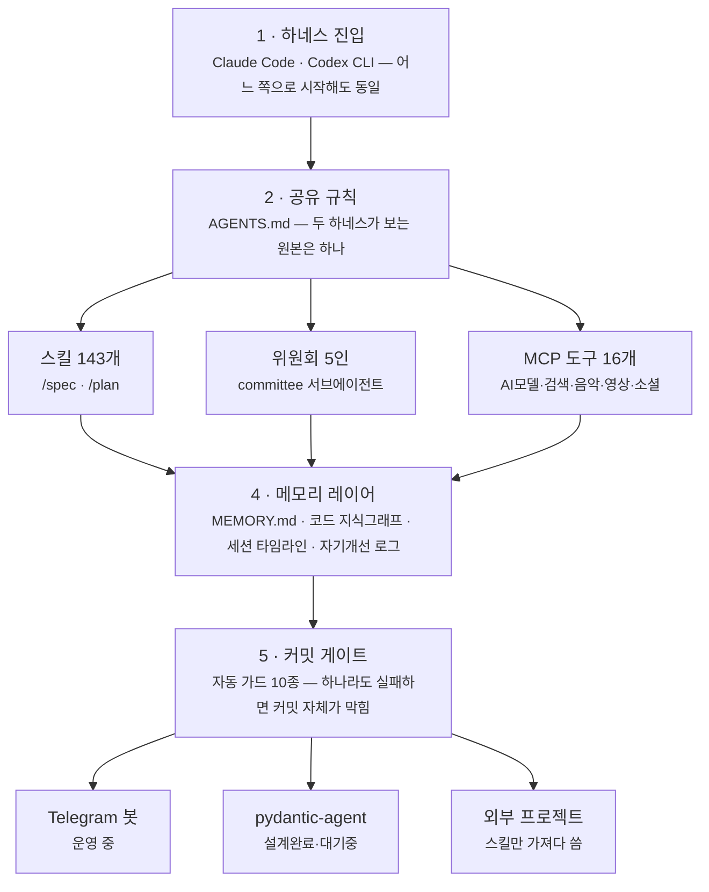

# 에이전트 하나가 아니라, 에이전트를 만드는 공장

이 저장소는 Claude Code와 Codex, 두 개의 코딩 에이전트가 **같은 규칙 하나**를 보고 움직이도록 설계돼 있습니다. 요청이 들어와서 실제로 무언가로 나오기까지, 6단계를 순서대로 따라가 보세요.

| 하네스 | MCP 도구 | 위원회 에이전트 | 스킬 자산 | 자동 안전 가드 |
|---|---|---|---|---|
| 2 | 16 | 5 | 143 | 10 |

## 구조도 — 요청 하나가 지나가는 길

색이 곧 단계입니다 — 하네스 → 규칙 → 도구·역할·스킬(3갈래) → 메모리 → 커밋 게이트 → 산출물(3갈래). 아래는 각 박스를 실제 파일·경로로 풀어 쓴 내용입니다.

## 단계별 자세히

**1 · 둘 중 하나로 들어온다** — 어느 쪽으로 시작해도 뒤 과정은 동일합니다.
- `Claude Code` — VS Code / CLI
- `Codex CLI` — OpenAI 하네스

**2 · 같은 규칙 하나를 본다** — 두 하네스가 각자 다른 규칙을 따르면 결과가 갈립니다. 그래서 원본은 하나뿐입니다.
- `AGENTS.md` — 코드 원칙·검증 방식·리뷰 기준

**3 · 도구·역할·스킬을 꺼내 쓴다** — 필요에 따라 조합해서 쓰는 재료들입니다.
- `MCP 도구 16개` — AI 모델·검색·음악·영상·소셜 연동
- `위원회 5인` — ai-expert·developer·business·marketing·designer-ux
- `스킬 143개` — 프로젝트 5 + 개인 114 + 공개 저장소 29

**4 · 세션을 넘어 기억한다** — 대화가 끝나도 사라지지 않는 4갈래 기억입니다.
- `MEMORY.md` — 검증된 사실 (장기)
- `codebase-memory-mcp` — 코드 지식그래프
- `claude-mem` — 세션 타임라인
- `skill-observations` — 스킬 자기개선 로그

**5 · 커밋 전에 10개 문을 통과한다** — 사람이 매번 확인하지 않아도, 규칙을 어기면 여기서 자동으로 막힙니다.
- 설정 무결성·시크릿 탐지·changelog 동기화 등 6종
- 두 하네스 미러 정합성 4종 (MCP·위원회·커맨드·문서)

**6 · 실제로 무언가가 된다** — 지금까지 이어진 구조가 최종적으로 만들어내는 것들입니다.
- `Telegram 봇` — 운영 중
- `pydantic-agent` — 설계는 끝, 트리거 대기 중 (ADR-001)
- 외부 콘텐츠 프로젝트가 스킬을 가져다 씀

## 그래서, 에이전트를 만들 수 있나?

네. 다만 조립된 모습은 "에이전트 1개"가 아니라 "에이전트를 계속 안전하게 만들어내는 공장"에 가깝습니다.

- ✅ **재료는 충분** — 도구·역할·스킬이 이미 연결돼 있어 새 에이전트를 만들 때 처음부터 짤 필요가 없습니다.
- ✅ **안전장치 내장** — 최소권한·자동 가드·미러 동기화가 구조 자체에 박혀 있어 실수가 조용히 커지지 않습니다.
- ⚠️ **완성품은 아직 적음** — 실제로 다 끝난 건 Telegram 봇 1개뿐 — 나머지는 재료거나 대기 중입니다.
- 🎯 **다음 병목** — 도구가 아니라 "만들다 만 것"을 끝까지 미는 실행력입니다.

---

hermes-agents 저장소의 실제 설정 파일(.mcp.json, .claude/, .codex/, scripts/, AGENTS.md, mcp_manager/, bots/)을 직접 읽어 작성 · 2026-09-05 기준, 수치는 파일 개수를 그대로 센 것이라 변동될 수 있습니다.
