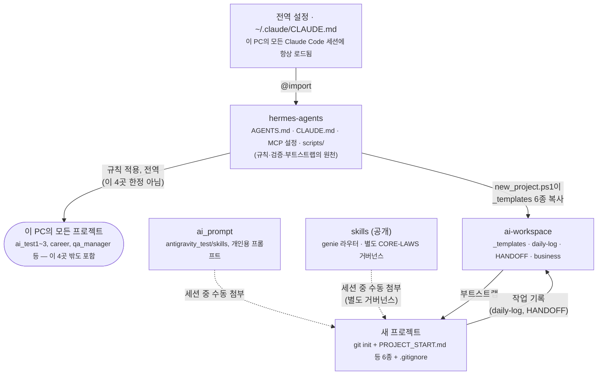

# 규칙은 하나, 저장소는 넷

`hermes-agents`는 나머지 세 곳을 코드로 참조하지 않습니다. 네 저장소는 각각 독립된 Git 저장소이고, `hermes-agents`는 **이 PC 전체에 적용되는 공통 규칙의 원천**이며 `ai-workspace`·`ai_prompt`·`skills`는 그 규칙표가 지정한 저장 대상입니다. 새 프로젝트를 만들 때 어디서 무엇을 가져오는지를 아래 그림 하나로 정리합니다.

## 구조도

실선 = 자동/스크립트로 일어나는 흐름. 점선 = 세션 중 사람이 직접 첨부해야 하는 흐름. 화살표 방향은 "누가 누구에게 무엇을 주는가"를 뜻합니다.

## 저장소별 역할

| 저장소 | 역할 | 새 프로젝트와의 관계 |
|---|---|---|
| `hermes-agents` | 공통 규칙(AGENTS.md/CLAUDE.md), MCP 설정, 검증·부트스트랩 스크립트 | **자동** 전역 규칙은 항상 적용, `new_project.ps1`은 요청 시 실행 |
| `ai-workspace` | 운영 기록, 결정, 멘토 문서, `_templates`(거버넌스 템플릿 원본), HANDOFF | **자동** 부트스트랩 시 템플릿 원본, 작업 후 일지 기록 대상 |
| `ai_prompt` | 재사용 가능한 프롬프트·스킬 자산(개인용) | **수동** 필요한 스킬 파일을 세션에 직접 첨부 |
| `skills` | 공개 GitHub 스킬 컬렉션, `genie` 라우터 + 자체 `CORE-LAWS.md` 거버넌스 | **수동** ai_prompt와 별개 컬렉션, 별도 판단 후 첨부 |

## 이 형식을 새 프로젝트마다 참조하면 좋은가

**맞습니다 — 단, "이 그림대로 코드를 참조한다"가 아니라 "이 역할 분담표대로 저장 위치를 고른다"는 의미로 참조하는 것입니다.** 실제로 프로젝트를 새로 만들 때는:

1. `hermes-agents/scripts/new_project.ps1`로 뼈대(문서 6종 + git + .gitignore)를 만들고,
2. 프로젝트 진행 중 필요한 스킬은 `ai_prompt` 또는 `skills`에서 골라 그때그때 첨부하고,
3. 일지·결정·핸드오프는 `ai-workspace`에 남깁니다.

이 문서는 그 순서를 그림으로 고정해 둔 것이며, 위 표의 역할 분담 자체가 바뀌지 않는 한 다시 그릴 필요가 없습니다. 다만 실제 스크립트 동작이나 파일 개수 같은 세부 수치는 이 문서에 넣지 않았습니다 — 예전 HTML 버전이 그런 수치 때문에 곧 낡아 링크가 빠졌던 전례가 있습니다.

---

최종 작성: 2026-09-07 · 이 저장소의 역할 분담이 바뀌면(예: 저장소 추가/합병) 이 문서도 함께 갱신하세요. 최신 원본은 항상 각 저장소의 README.md/CLAUDE.md입니다.
